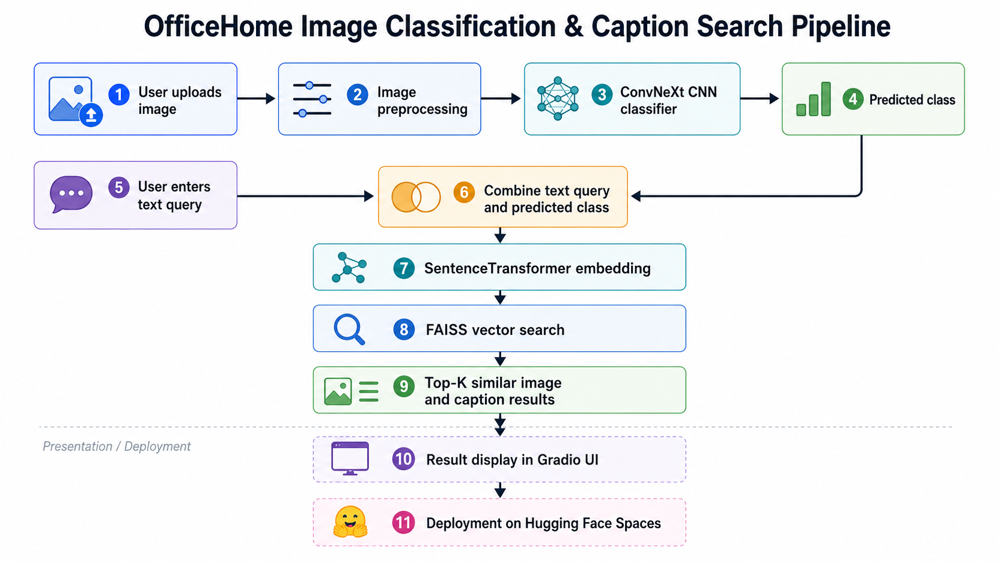
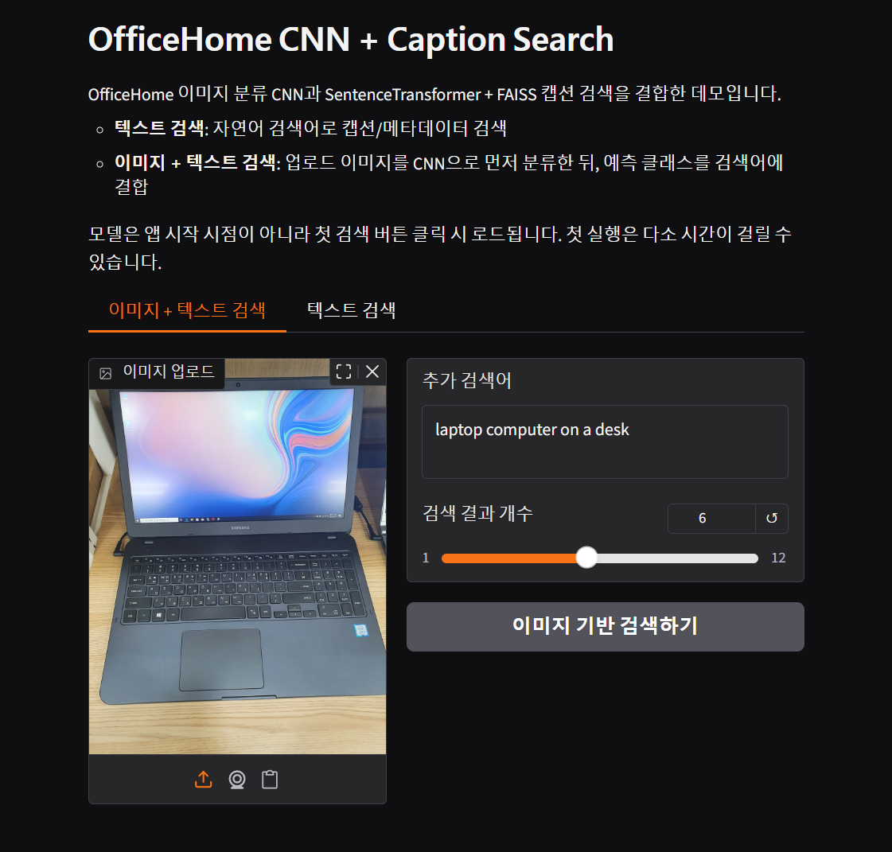
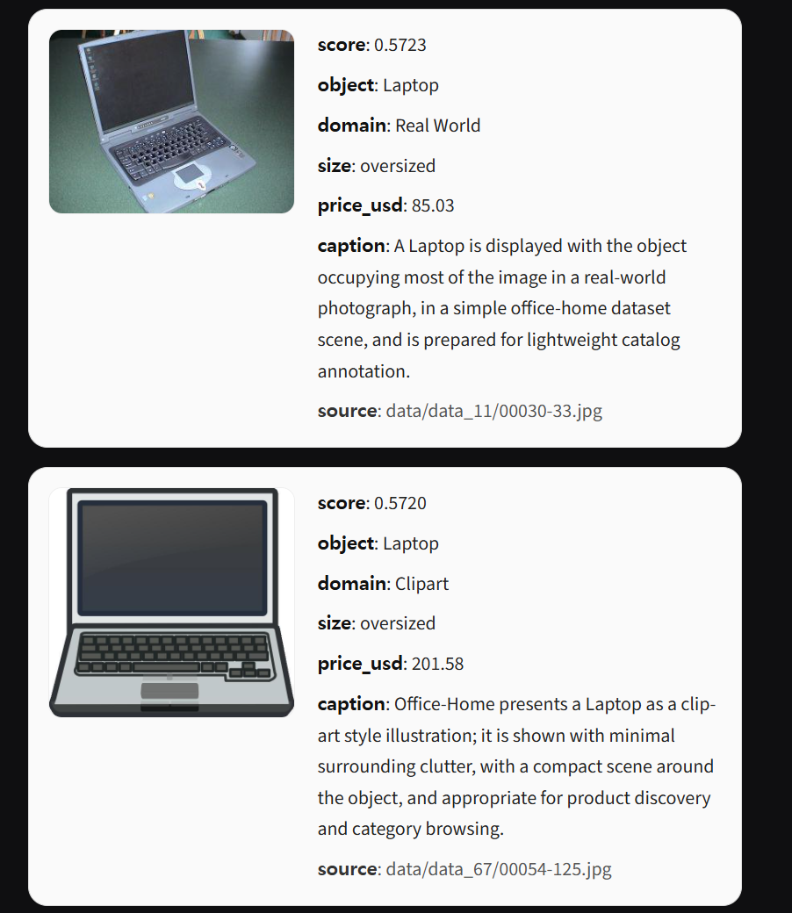

# OfficeHome 이미지 분류 모델 검색 시스템

* Hugging Face Space: [spsychic2/officehome-cnn-caption-search](https://huggingface.co/spaces/spsychic2/officehome-cnn-caption-search)
* GitHub Repository:  https://github.com/predpoke/SuperSecondProject

---

## 1. 프로젝트 개요

본 프로젝트는 OfficeHome 이미지 데이터를 기반으로 한 이미지 분류 및 캡션 검색 시스템입니다.

ConvNeXt 기반 CNN 이미지 분류 모델과 SentenceTransformer 기반 텍스트 임베딩, FAISS 벡터 검색을 결합하여 사용자가 업로드한 이미지와 입력한 캡션에 가장 유사한 이미지 및 캡션 데이터를 검색합니다.

최종 결과는 Gradio 기반 웹 인터페이스를 통해 이미지, 캡션, 예측 클래스, 유사도 점수 형태로 제공합니다.

---

## 2. 문제 정의

단순히 입력 이미지가 어떤 클래스에 속하는지 예측하는 것에 그치지 않고, 사용자가 입력한 이미지와 캡션을 함께 활용하여 가장 유사한 이미지, 캡션, 메타데이터를 확인할 수 있는 검색 시스템을 구현하고자 했습니다.

본 프로젝트의 핵심은 단순 이미지 분류가 아니라, 이미지 분류 결과를 검색 쿼리의 문맥 정보로 활용하여 사용자 입력과 가장 가까운 자료를 찾아주는 검색 기반 시스템을 구현하는 것입니다.

이를 위해 CNN 모델의 예측 결과와 사용자의 텍스트 입력을 결합하고, SentenceTransformer와 FAISS를 활용해 유사도 기반 Top-K 검색을 수행했습니다.

---

## 3. 주요 기능

### 이미지 + 텍스트 기반 검색

사용자가 이미지를 업로드하고 추가 검색어를 입력하면, CNN 모델이 먼저 이미지 클래스를 예측합니다.

이후 예측 클래스와 사용자가 입력한 텍스트를 결합하여 검색 쿼리를 만들고, SentenceTransformer + FAISS 검색 파이프라인을 통해 가장 유사한 이미지와 캡션을 검색합니다.

예시:

```text
이미지 업로드
캡션 입력: black monitor
CNN 예측 클래스: Monitor
최종 검색 쿼리: black monitor, Monitor
검색 결과: 유사 이미지, 캡션, 유사도 점수, 메타데이터
```

---

## 4. 전체 파이프라인



## 5. 사용 기술

| Category             | Tech Stack           |
| -------------------- | -------------------- |
| Language             | Python               |
| Deep Learning        | PyTorch, Torchvision |
| Image Classification | ConvNeXt             |
| Text Embedding       | SentenceTransformer  |
| Vector Search        | FAISS                |
| Data Processing      | Pandas               |
| Web Demo             | Gradio               |
| Deployment           | Hugging Face Spaces  |
| Version Control      | GitHub               |

---

## 6. 사용 모델

### 6.1 CNN 이미지 분류 모델

* 모델: ConvNeXt 기반 이미지 분류 모델
* 데이터셋: OfficeHome 이미지 데이터
* 역할: 업로드된 이미지를 OfficeHome 클래스 중 하나로 분류
* 출력: 예측 클래스, 예측 확률

### 6.2 SentenceTransformer

* 역할: 사용자 입력 텍스트와 캡션 데이터를 임베딩 벡터로 변환
* 활용 방식: 텍스트 간 의미적 유사도 검색

### 6.3 FAISS

* 역할: 임베딩 벡터 기반 유사도 검색
* 활용 방식: 입력 쿼리와 가장 가까운 Top-K 결과 반환

---

## 7. 프로젝트 구조

```text
SuperSecondProject/
│
├─ README.md
├─ app.py
├─ requirements.txt
│
├─ notebooks/
│  ├─ 01_cnn_convnext_training.ipynb
│  └─ 02_caption_faiss_search.ipynb
│
└─ assets/
   ├─ demo_text_search.png
   └─ demo_image_search.png
```

| Path                                       | Description                                 |
| ------------------------------------------ | ------------------------------------------- |
| `README.md`                                | 프로젝트 소개 및 실행 방법 문서                          |
| `app.py`                                   | Gradio 기반 최종 실행 코드                          |
| `requirements.txt`                         | 실행에 필요한 Python 패키지 목록                       |
| `notebooks/01_cnn_convnext_training.ipynb` | ConvNeXt 기반 CNN 이미지 분류 모델 학습 노트북            |
| `notebooks/02_caption_faiss_search.ipynb`  | SentenceTransformer + FAISS 기반 캡션 검색 구축 노트북 |
| `assets/`                                  | 데모 화면 및 프로젝트 설명 이미지 저장 폴더                   |

---

## 8. 실행 방법

### 8.1 Hugging Face Space에서 실행

1. Hugging Face Space 링크에 접속합니다.
2. 이미지와 검색어를 입력합니다.
3. 검색 버튼을 클릭합니다.
4. 검색 결과로 반환된 이미지, 캡션, 유사도 점수, 메타데이터를 확인합니다.

### 8.2 로컬에서 실행

```bash
pip install -r requirements.txt
python app.py
```

---

## 9. 데모 화면

### 9.1 텍스트 검색 예시



### 9.2 이미지 + 텍스트 검색 예시



---

## 10. 배포 과정에서 해결한 문제

Hugging Face Spaces 배포 과정에서 앱 시작 시 CNN 모델, SentenceTransformer, FAISS 인덱스를 모두 한 번에 로드하면 앱이 `Starting` 상태에 오래 머무르는 문제가 발생했습니다.

이를 해결하기 위해 모델을 앱 시작 시점에 즉시 로드하지 않고, 사용자가 실제 검색을 실행하는 순간 처음 로드하는 lazy loading 방식으로 수정했습니다.

이를 통해 Gradio UI가 먼저 실행되고, 첫 검색 시 필요한 모델을 로드하도록 개선했습니다.

---

## 11. 한계 및 개선 방향

* 검색 품질은 캡션 데이터와 메타데이터 품질에 영향을 받습니다.
* CNN 이미지 분류 모델의 검증 정확도는 약 0.89 수준입니다. 따라서 이미지 예측이 잘못될 경우 최종 검색 결과에도 영향을 줄 수 있습니다.
* 현재 구조는 텍스트 임베딩 중심의 검색입니다. 향후 이미지 임베딩 기반 검색을 추가하면 더 정교한 멀티모달 검색으로 확장할 수 있습니다.
* 모델 로딩 속도와 메모리 사용량 최적화를 통해 배포 안정성을 추가로 개선할 수 있습니다.
